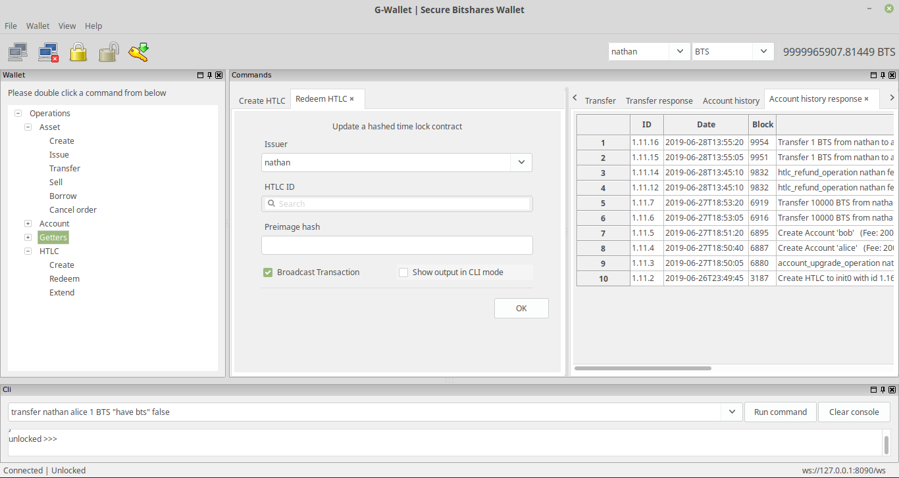
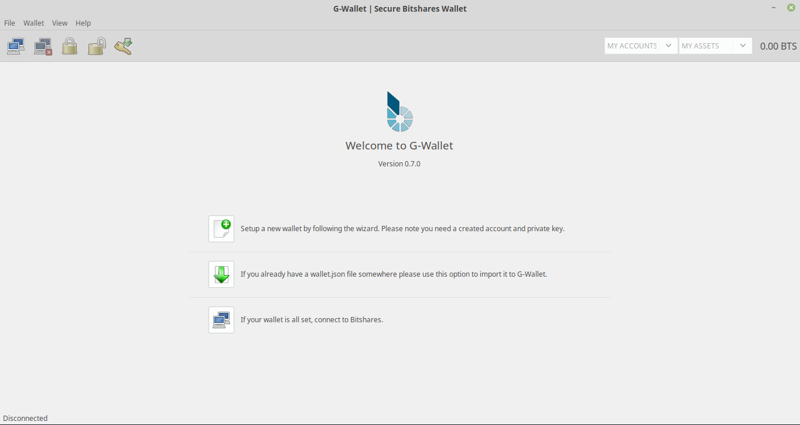
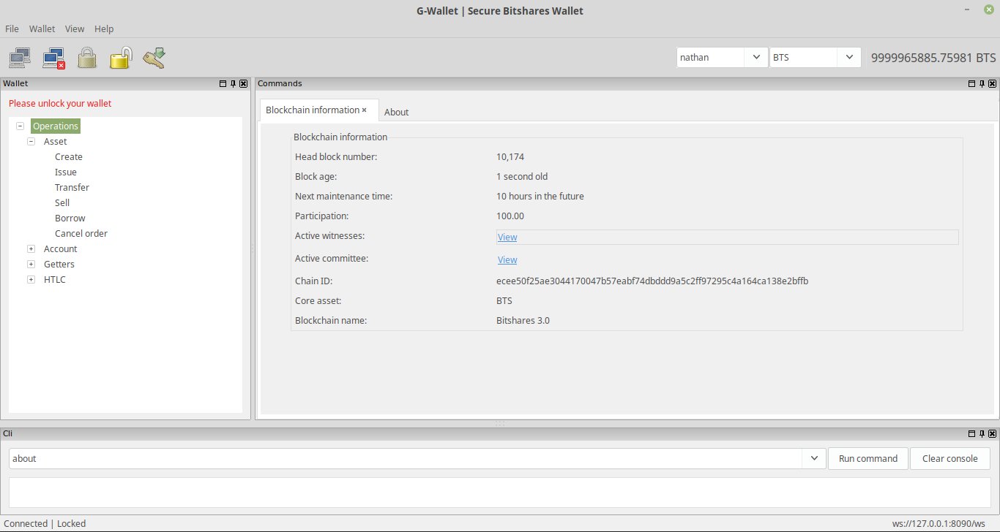
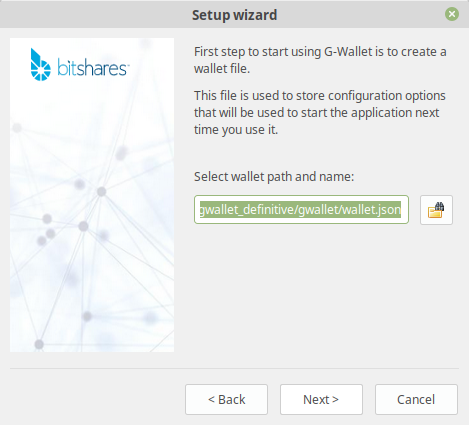
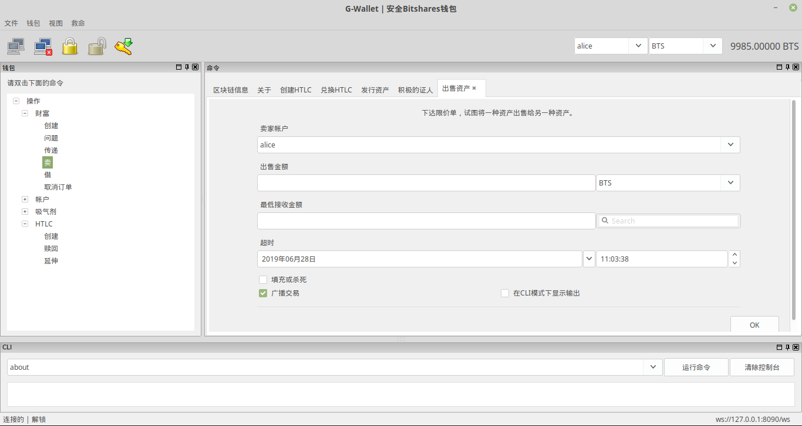
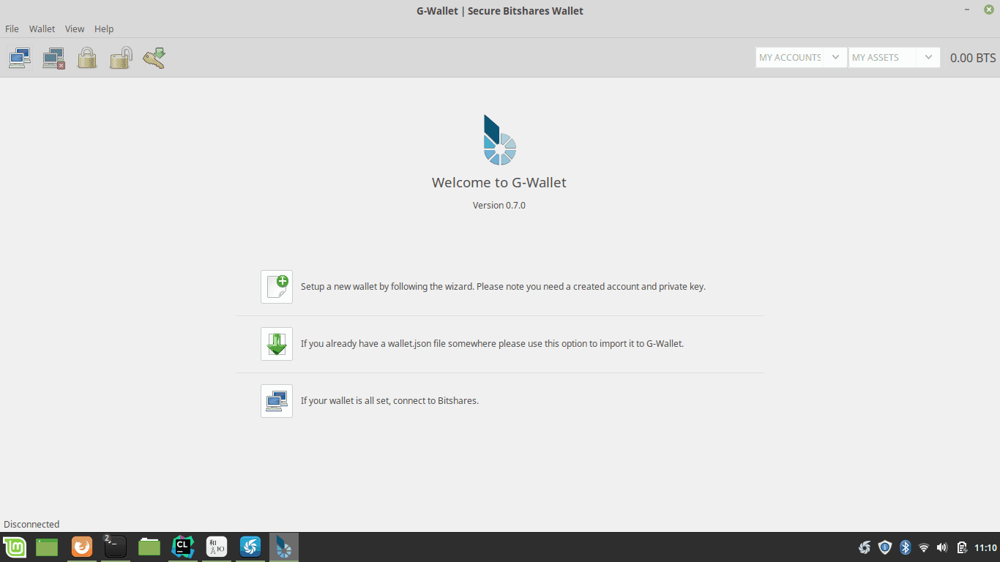

# G-Wallet - Desktop Bitshares Wallet

G-Wallet is a Bitshares desktop(Linux, Windows, MAC) wallet program written in C++ using [wxWidgets](https://www.wxwidgets.org/).

G-Wallet code is EXPERIMENTAL.

## Software design

G-Wallet is currently not a complete program. It is the building blocks for one, with scaling in mind. The final goal is to support all the cli_wallet functionality and more.

For this, we separated the development in different classes, files and directories. All the classes can communicate with the others when they need by pointers to instances.

The `GWallet` class is the main class and it is in charge of managing the program menu, toolbar, statusbar and other elements outside the client area. Everything inside the client area haves its own class, rest is managed by `GWallet` class.

`GWallet` class will also manage the state of the wallet, the state decides what the user will see.

The program use the same wallet file format as the `cli_wallet` software, you can import a wallet file or create new one by having account and private key pair.

The program will display a welcome window when started:

If we already have an account and connect the main mode of the program will open with 3 different `wxAUI`(advanced user interface) panes:

The top left pane(`Wallet`) is a list of commands the program currently supports. You need to be unlocked to use the commands.

Top right pane(`Commands`) will display command input forms and outputs. You can move your tabs and create new notebooks inside this area to match your visualization needs.

The bottom(`Cli`) pane provides the same functionality as the `cli_wallet` program.

The connection stuff is done in a `Bitshares` class.

G-Wallet makes use of `wxConfig` to store some data that will help the user when starting the program next time.

## RAD

https://github.com/wxFormBuilder/wxFormBuilder

## Install

Ubuntu instructions assuming you already have all needed to install bitshares-core software.

Add wxWidgets to your system:

    sudo apt-get install libwxgtk3.0-dev

Get the code and build:

    git clone https://github.com/bitshares/gwallet
    cd gwallet
    git submodule update --init --recursive
    cmake -DCMAKE_BUILD_TYPE=RelWithDebInfo .
    make

Run the following to get started:

    ./gwallet
    
Use the File -> New (CTRL-N) to start the configuration wizard when running the first time:

## Language

Use File -> Change language to translate the wallet, English, Spanish and Chinese are supported.

## Usage

The interface is pretty straight forward, in the following short video a transfer is made:

